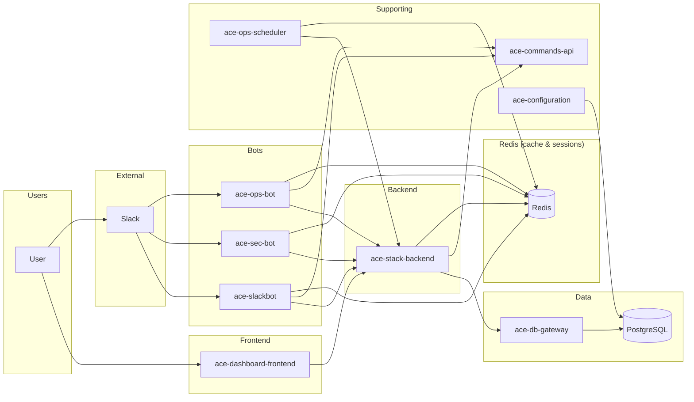
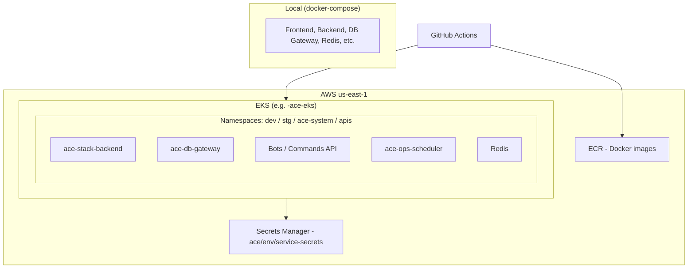
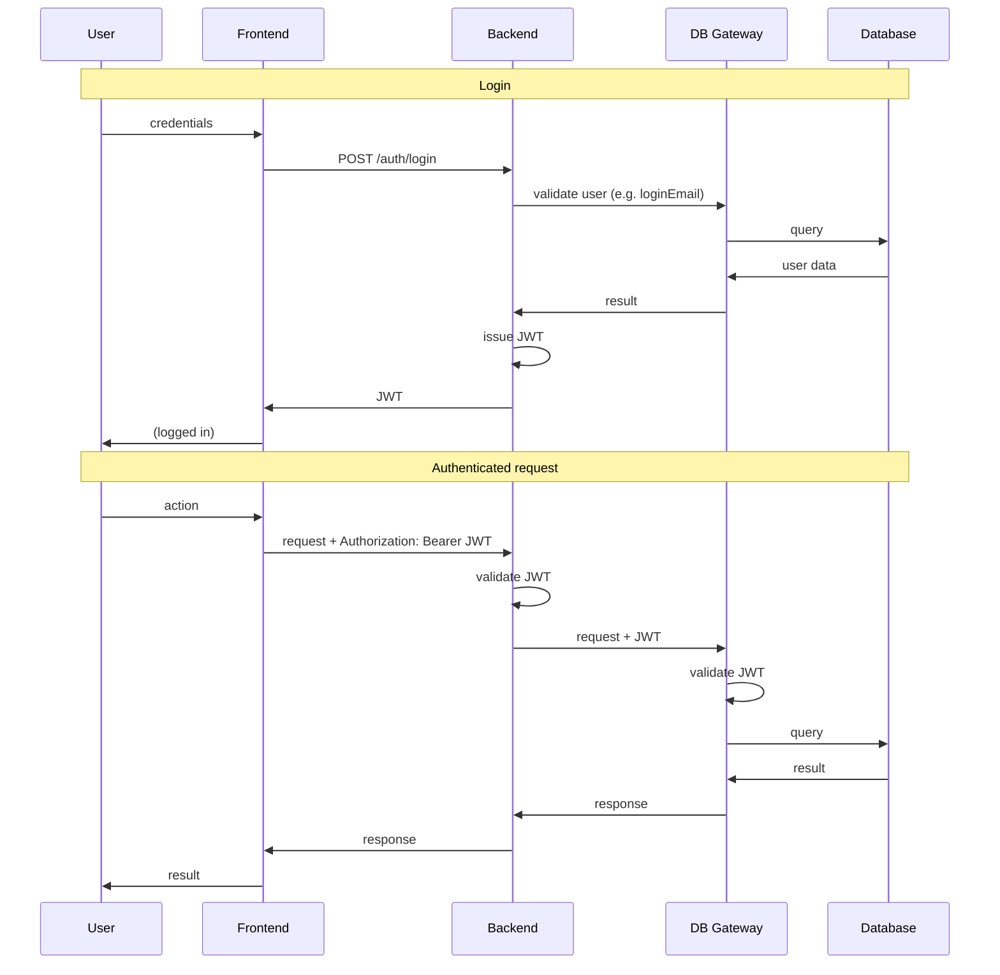

# ACE Architecture Diagrams

This document is the central place for **architecture diagrams** in Mermaid format. It complements [overview.md](./overview.md) and [data-flow.md](./data-flow.md). When the structure changes, update these diagrams and the referenced docs.

---

## Component Diagram (High-Level)

Services and main connections. The **user** can access ACE via the **frontend** (dashboard) or via **Slack** (bots). Frontend talks to Backend; Backend talks to DB Gateway (and optionally Commands API); Backend reads/writes configuration data **via DB Gateway**, not via a separate Config HTTP API—**ace-configuration** owns the configuration schema and models and connects to the database (migrations, schema). Bots are triggered by Slack and use **Redis** (sessions); **ace-stack-backend** and **ace-ops-scheduler** also use Redis (cache, locks, scheduler tracking). ace-ops-scheduler triggers Backend on a schedule.

**Notes:**

- **Backend and configuration**: The backend does not call ace-configuration as an HTTP service. It reads and writes configuration data via **ace-db-gateway** (e.g. admin `/api/configurations`). ace-configuration is the repo that **owns the configuration schema and Sequelize models**; it connects to the database for migrations and schema. Other services may import its models and use DB Gateway or direct DB access as per ace-configuration integration patterns.
- **Configuration and database**: ace-configuration manages the configuration tables in PostgreSQL; the arrow **Config → DB** represents that schema ownership and DB connection (migrations, models).
- **User and Slack**: The user can reach ACE through the **dashboard** (User → Dashboard) or through **Slack** (User → Slack); from Slack, events go to the bots (Slack → Bots).
- **Redis**: Used by **bots** (session storage), **ace-stack-backend** (omnichannel payload grouping, scheduler result tracking, redlock, cache invalidation), and **ace-ops-scheduler** (e.g. KnowledgeBase cache). All of these connect to Redis.

---

## Deployment Diagram (High-Level)

ACE runs on EKS in AWS us-east-1. Local uses docker-compose. EKS clusters: **development-ace-eks** (dev, stg, demo namespaces) and **production-ace-eks** (prod, apis, ace-system). Redis runs in-cluster or as a managed service (e.g. ElastiCache) and is used by backend, bots, and ops-scheduler.

**Note:** Frontend may be served from the same cluster (e.g. static assets) or from S3/CloudFront depending on the environment. PostgreSQL may run in RDS or in-cluster; the diagram emphasizes EKS workloads and CI/CD.

---

## Auth and Request Flow (Sequence)

Simplified sequence: User logs in (backend validates credentials via DB Gateway), then makes an authenticated request that triggers a backend call to DB Gateway.

---

## How to Update

- When **adding or removing a service**, update the component diagram and the service list in [overview.md](./overview.md) and [service-catalog.md](./service-catalog.md).
- When **changing deployment** (e.g. new namespace, new cluster), update the deployment diagram and [deployment.md](./deployment.md).
- When **changing auth or request flow**, update the sequence diagram and [data-flow.md](./data-flow.md).

**Agents**: Keep diagrams in sync with the written docs. If you add a new service or integration, add or adjust the corresponding Mermaid and the referenced overview/data-flow/integrations docs.
