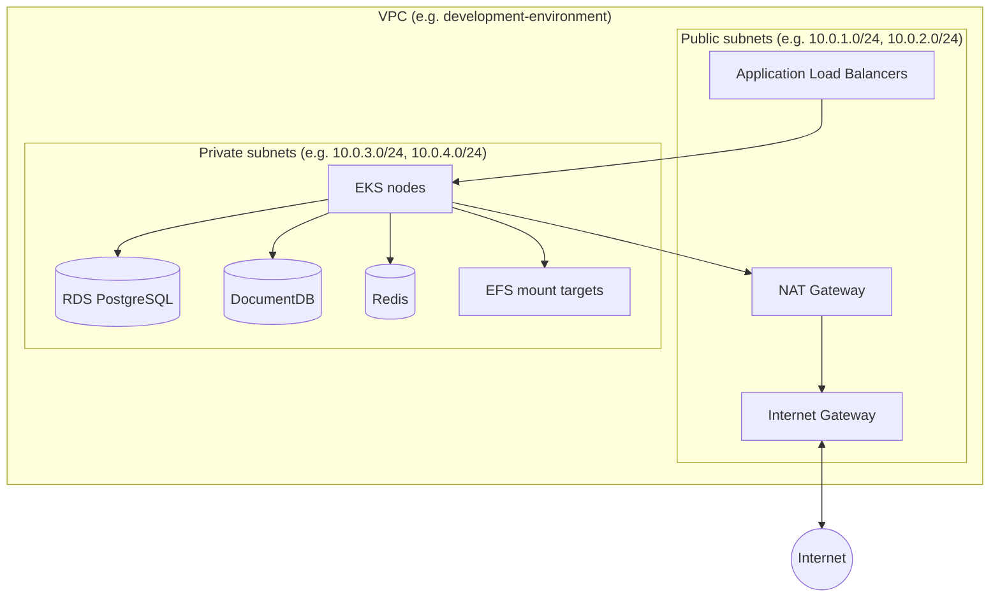
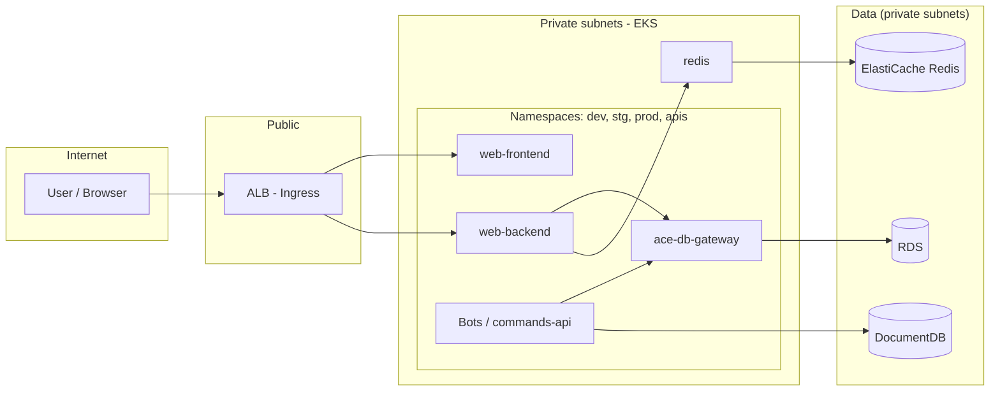

# Infrastructure Diagrams

This document provides **diagrams** of the ACE infrastructure: VPC, public and private subnets, placement of main components, and communication paths. It does not include sensitive data (no account IDs, no endpoint addresses that reveal internal naming beyond patterns).

---

## VPC and subnets (high-level)

ACE uses one VPC per environment (e.g. development, production). Each VPC has **public subnets** and **private subnets** in two (or three) Availability Zones. The Terraform module **terraform-library/vpc** creates:

- **Public subnets**: Internet Gateway for inbound/outbound traffic; tagged with `kubernetes.io/role/elb = 1` so the AWS Load Balancer Controller can create **Application Load Balancers (ALBs)** here.
- **Private subnets**: Outbound traffic via a **NAT Gateway** (sitting in a public subnet). Tagged with `kubernetes.io/role/internal-elb = 1` for internal load balancers. **EKS node groups**, **RDS**, **DocumentDB**, **ElastiCache (Redis)**, and **EFS** mount targets are in **private subnets** (no direct public IPs).

---

## What runs in public vs private subnets

| Location        | Components |
|----------------|------------|
| **Public subnets** | Internet Gateway, NAT Gateway (one), **ALB** (created by AWS Load Balancer Controller for Ingress). No application pods or data stores. |
| **Private subnets** | **EKS worker nodes** (all application pods), **RDS**, **DocumentDB**, **ElastiCache (Redis)**, **EFS** mount targets. |

User and external traffic flows: **Internet → ALB (public) → EKS nodes (private)**. Outbound from pods: **EKS nodes → NAT Gateway → Internet** (e.g. GitHub, AWS APIs, external APIs).

---

## EKS and application flow

- **ALB** is in public subnets; it targets **EKS pods** in private subnets (via NodePort or instance target).
- **Pods** talk to **RDS**, **DocumentDB**, and **Redis** over the VPC (security groups allow VPC CIDR or specific groups). No public endpoints for databases.

---

## End-to-end request path (simplified)

1. **User** → HTTPS → **ALB** (public subnet, TLS termination or passthrough).
2. **ALB** → **Ingress** → **Service** → **Pod** (e.g. web-backend in private subnet).
3. **web-backend** → **ace-db-gateway** (K8s service DNS) → **RDS** (private subnet, port 5432).
4. **web-backend** → **Redis** (K8s service or ElastiCache endpoint in private subnet).
5. **commands-api** or other services → **DocumentDB** (private subnet, port 27017).

All service-to-service and pod-to-database traffic stays inside the VPC.

---

## Network layout (CIDR and routing)

- **VPC CIDR**: Defined in cluster tfvars (e.g. `10.0.0.0/16`).
- **Public subnets**: Typically `10.0.1.0/24`, `10.0.2.0/24` (and optionally a third AZ). Route table: `0.0.0.0/0` → Internet Gateway.
- **Private subnets**: Typically `10.0.3.0/24`, `10.0.4.0/24` (and optionally a third). Route table: `0.0.0.0/0` → NAT Gateway (in a public subnet).
- **EKS**: Node groups are in **private subnets** only. Pods get private IPs from the VPC CIDR (or from a dedicated pod CIDR if configured).
- **RDS / DocumentDB / Redis**: Placed in **private subnets** via subnet groups; security groups restrict access to the VPC CIDR (or to specific security groups used by EKS nodes).

---

## Summary

| Element     | Public subnet | Private subnet |
|------------|----------------|----------------|
| IGW        | Yes            | —              |
| NAT GW     | Yes (one)      | —              |
| ALB        | Yes            | —              |
| EKS nodes  | No             | Yes            |
| RDS        | No             | Yes            |
| DocumentDB | No             | Yes            |
| Redis      | No             | Yes            |
| EFS        | No             | Yes (mount targets) |

---

## Links

- [aws-resources.md](./aws-resources.md) — EKS, VPC, RDS, DocumentDB, Redis
- [terraform-modules.md](./terraform-modules.md) — VPC and EKS modules
- [kubernetes-and-deployment.md](./kubernetes-and-deployment.md) — Ingress and ALB

