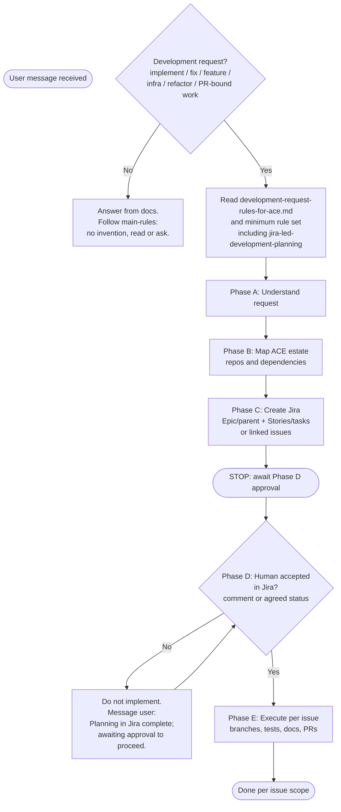

# Golden path: development requests (decision tree)

**Audience**: ACE and human contributors. Use this page to see **when to stop** and wait for Jira before coding.

**Related**: [jira-led-development-planning.md](./jira-led-development-planning.md), [AI-AGENT-QUICKSTART.md](./AI-AGENT-QUICKSTART.md), [development-request-rules-for-ace.md](../development-request-rules-for-ace.md).

---

## Flowchart

---

## Plain-language sequence

1. **New feature or change that touches code or infra?** If **no**, respond from documentation; no Jira gate.
2. If **yes**: read the development entry doc and Jira-led rules **first**.
3. **Plan** in conversation only as needed to clarify; **record** the real plan in **Jira** (parent + children or linked issues).
4. **After creating issues**: **stop**. Tell the user the Jira keys and that you are **waiting for approval**.
5. **Only after** explicit go-ahead (Jira + team habit): branches, implementation, validation, PRs **per issue**.

---

## What “development request” means

Same scope as [development-request-rules-for-ace.md](../development-request-rules-for-ace.md): anything that changes behavior, APIs, schemas, migrations, configs affecting runtime, IaC/K8s for ACE, refactors with PR intent, etc. When in doubt, treat it as a development request and use Jira-led workflow unless the user explicitly opts out for that task.
